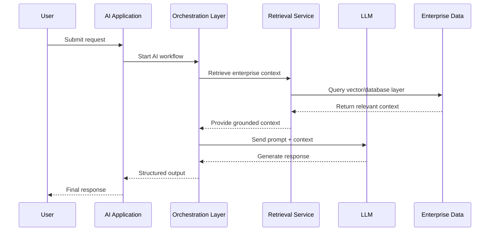
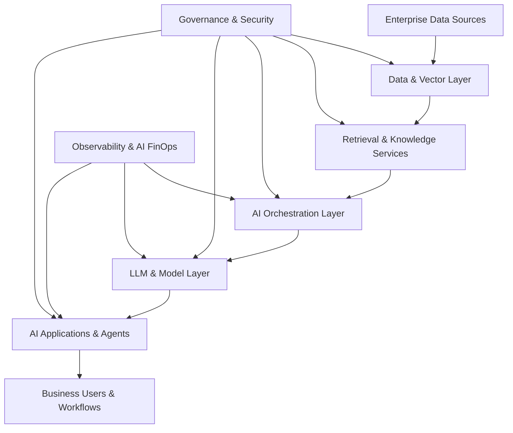

# Enterprise AI Reference Architecture

## Overview

Enterprise AI platforms require more than model access.

Operational AI systems depend on integrated architecture layers spanning:
- data infrastructure
- orchestration
- model management
- governance
- observability
- security
- business workflow integration

This document outlines a high-level reference architecture for scalable enterprise AI systems.

---

# Core Architecture Layers

## 1. Data Layer

The data layer provides structured and unstructured enterprise context for AI systems.

Typical components include:
- data warehouses
- lakehouses
- vector databases
- streaming pipelines
- metadata systems
- document repositories
- identity and access systems

Key priorities:
- data quality
- governance
- discoverability
- retrieval optimisation
- permission management

---

## 2. AI Model Layer

The model layer manages access to:
- hosted foundation models
- open-source models
- local inference models
- fine-tuned enterprise models
- embedding models

Typical enterprise patterns include:
- multi-model routing
- fallback models
- workload-specific model selection
- latency optimisation
- inference cost management

---

## 3. Orchestration Layer

The orchestration layer coordinates:
- prompts
- workflows
- tools
- retrieval pipelines
- agent execution
- external APIs

Typical orchestration frameworks include:
- LangGraph
- Semantic Kernel
- OpenAI Agents SDK
- CrewAI
- custom orchestration frameworks

Key responsibilities:
- workflow sequencing
- context management
- memory handling
- tool routing
- agent coordination

---

## 4. Retrieval & Knowledge Layer

Enterprise AI systems increasingly depend on retrieval architectures.

Typical capabilities include:
- retrieval-augmented generation (RAG)
- semantic search
- vector retrieval
- hybrid search
- enterprise document grounding
- permission-aware retrieval

Key priorities:
- retrieval accuracy
- grounded responses
- source traceability
- hallucination reduction

---

## 5. Governance & Security Layer

Governance capabilities should operate across all AI layers.

Typical controls include:
- role-based access control
- audit logging
- prompt filtering
- model evaluation
- PII protection
- compliance enforcement
- human approval workflows

Enterprise AI governance must balance:
- experimentation
- operational safety
- compliance
- scalability

---

## 6. Observability Layer

Operational AI systems require observability beyond traditional application monitoring.

Typical observability capabilities include:
- prompt tracing
- latency monitoring
- token consumption tracking
- hallucination analysis
- retrieval evaluation
- workflow monitoring
- cost analysis

Observability is increasingly critical for:
- operational reliability
- governance
- AI FinOps
- quality assurance

---

## 7. Application Layer

The application layer exposes AI capabilities into enterprise workflows.

Typical examples include:
- AI copilots
- customer support agents
- recommendation systems
- workflow automation
- enterprise search
- executive intelligence assistants
- operational decision support

The application layer is where enterprise value is ultimately realised.

---

# Cross-Cutting Concerns

## AI FinOps

Enterprise AI systems require active cost management across:
- inference workloads
- vector retrieval
- orchestration pipelines
- GPU infrastructure
- API consumption

## Evaluation Frameworks

Evaluation should measure:
- response quality
- groundedness
- business accuracy
- workflow reliability
- latency
- operational impact

## Human-in-the-Loop Design

Many enterprise AI workflows still require:
- approvals
- escalation paths
- validation steps
- manual override capability

Human oversight remains critical in high-risk workflows.

---

# Common Enterprise AI Architecture Failures

## Isolated Pilots

Disconnected proofs of concept without integration into enterprise workflows.

## Missing Governance Layers

Rapid AI deployment without observability, evaluation or policy enforcement.

## Tooling Sprawl

Uncontrolled platform adoption creating duplicated capabilities and escalating costs.

## Weak Data Foundations

Poor retrieval quality caused by fragmented or low-quality enterprise data.

---

# Example Enterprise AI Workflow

# Enterprise AI Design Principles

## Modular Architecture

Enterprise AI systems should avoid tightly coupled implementations and instead support reusable orchestration and model layers.

## Model Agnostic Design

Architectures should support multiple model providers and avoid dependency on a single vendor ecosystem.

## Retrieval-First Thinking

Reliable enterprise AI systems increasingly depend on grounded retrieval patterns rather than standalone prompting.

## Governance by Design

Governance should operate as an embedded architectural capability rather than a reactive compliance process.

## Human Oversight

Human review and escalation paths remain critical for high-impact operational workflows.

## Observability as a Core Capability

AI systems require operational tracing, evaluation and cost monitoring from the beginning of deployment.

# Typical Enterprise AI Technology Stack

| Layer | Typical Technologies |
|---|---|
| Data Platform | Databricks, Snowflake, BigQuery |
| Vector Database | Pinecone, Weaviate, pgvector |
| Orchestration | LangGraph, Semantic Kernel, CrewAI |
| LLM Providers | OpenAI, Anthropic, Mistral, Llama |
| Observability | Langfuse, Arize, Weights & Biases |
| APIs & Integration | FastAPI, GraphQL, REST |
| Security & Governance | RBAC, audit logging, policy enforcement |

# High-Level Enterprise AI Architecture

# Final Thought

Enterprise AI architecture is not simply about deploying models.

The real challenge is operationalising AI systems reliably, securely and economically across complex enterprise environments.

